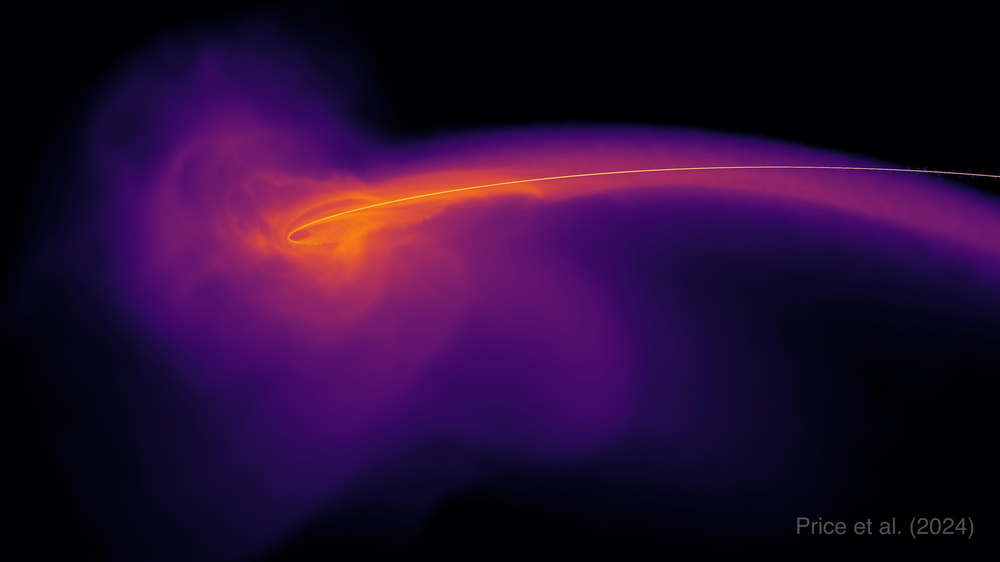
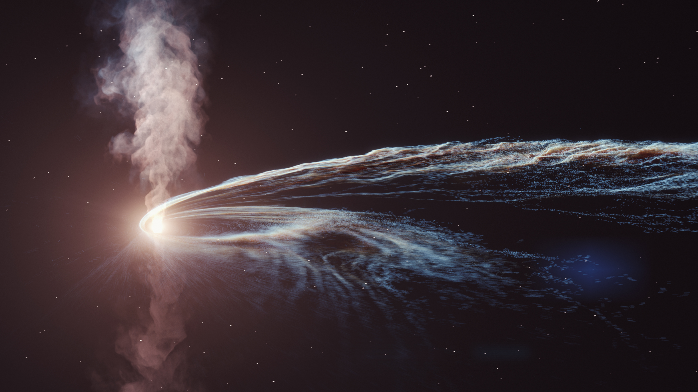
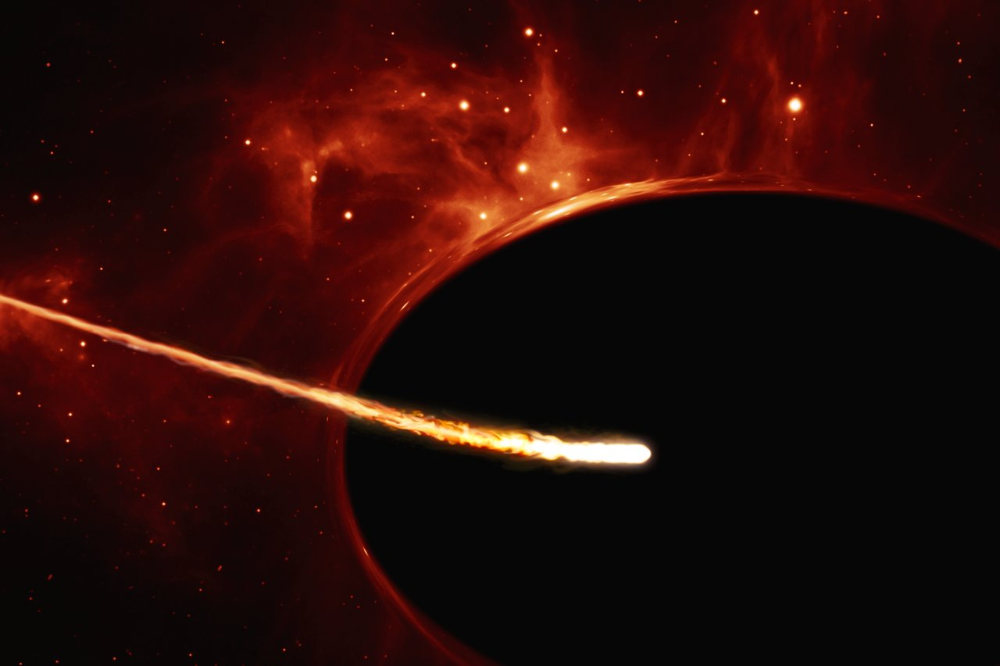
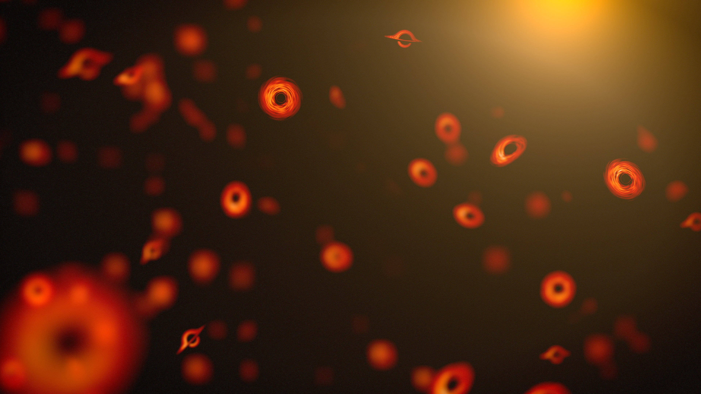
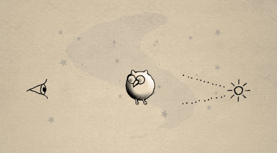
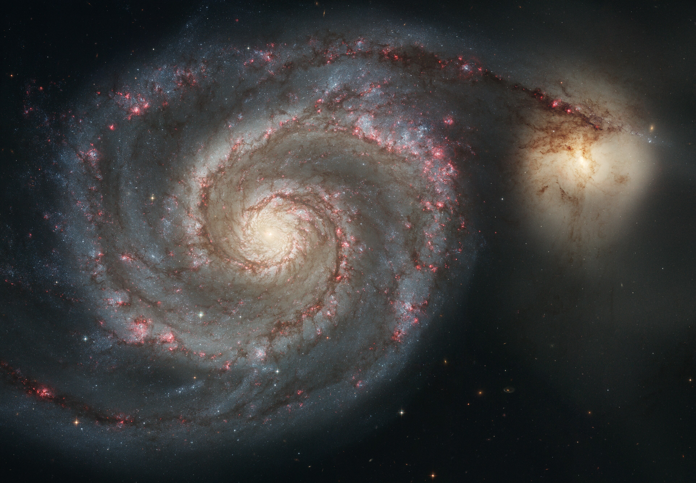
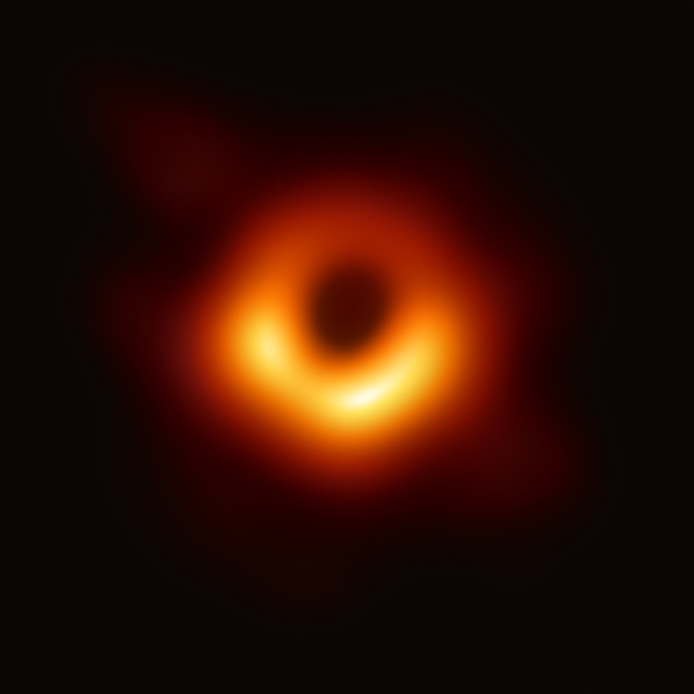

# KAMUI VISUAL STORYBOARD — how the vortex activation should look and move

> Companion to [`KAMUI-RESEARCH.md`](KAMUI-RESEARCH.md) (the physics + canon knowledge base).
> This document is the **visual/animation spec**: what the viewer sees, second by second,
> with the reasoning behind every choice. Three asset sets support it:
>
> - **Live mockup** — [`kamui-visuals/kamui-mockup.html`](kamui-visuals/kamui-mockup.html):
>   open it in any browser (double-click; no server needed). Replay button, 0.25× slow motion.
> - **Blender keyframes** — `kamui-visuals/blender/keyframe-0…7.png`: 8 stylized 3D stills
>   rendered from [`kamui_scene.py`](kamui-visuals/blender/kamui_scene.py).
> - **Real reference images** — `kamui-visuals/references/`: freely-licensed science
>   visualizations of the exact moments described (see `references/CREDITS.md`).

---

## 0. The one-sentence version

A clicked cosmic body wakes up, **space itself starts swirling first**, then everything
nearby — stars, planets, nebulas, the anchor star — is dragged into a whirlpool, **loses
its shape** (stretches into luminous streams), feeds the glow around the core, and at the
end of the swirl reality **tears open into the Kamui portal**.

Design law (from the research doc): **the swirl is the teleport** — the vortex and the
portal are one object; suction is just the door opening gradually.

---

## 1. Master timeline (~2.5 s active + hold)

| Window | Phase | Name | What the viewer sees | Driven by |
|---|---|---|---|---|
| T+0.00–0.20 | 0 | Activation pulse | A soft ring of light expands from the clicked body; its core brightens; the eye-like spiral motif flashes once | Mangekyō "spin-up"; gravity well deepening |
| T+0.20–0.90 | 1 | Reality bends first | **Background starfield smears into tangential arcs**, the nebula layer warps and starts rotating; nothing has moved toward the core yet | Frame dragging — spacetime swirls before matter falls |
| T+0.90–1.80 | 2 | The whirlpool grips | Trailing **log-spiral streaks** appear around the core; bodies begin drifting inward on curved paths; inner regions visibly rotate faster than outer | Angular momentum → inspiral; differential rotation |
| T+1.80–2.60 | 3 | **Form loss (hero)** | Bodies develop tidal bulges, **elongate toward the core, then shred into luminous streams**; the anchor star dissolves into a comet-tail wrapping the vortex | Tidal force ∝ 1/r³ → spaghettification; tidal disruption event |
| T+2.60–3.30 | 4 | Feeding vortex | All streams coil tight; the halo white-hot at the inner rim; one side brighter (optional Doppler); brightness peaks | Accretion heating; ISCO inner edge |
| T+3.30–3.55 | 5 | The tear | A **beat of near-silence** (streams fade, everything dims), then a **white ring flashes outward** with a radial burst + screen shake | Implosion → release; wormhole tear pacing |
| T+3.55–hold | 6 | Portal open | A calm dark void with a thin bright ring and a slow residual swirl; the "door" is open | Kamui's spiralling void = the eye's pinwheel motif |

Keyframe stills for each phase: `blender/keyframe-0-activation-pulse.png` … `keyframe-7-portal-open.png`.

---

## 2. Phase-by-phase visual spec

### Phase 0 — Activation pulse `blender/keyframe-0`
- A single soft **ring of warm light** expands from the body's silhouette (fast out, fading).
- The body's own glow lifts (it "wakes"); the rest of the scene is untouched.
- **Do not** show suction yet. The power is gathering, not pulling.
- Sound/pacing read: a sharp inhale. Duration ~0.2 s.

### Phase 1 — Reality bends first `blender/keyframe-1`
- **The universe surface (background starfield + nebula layer) moves before any object does.**
  Stars near the vortex smear into short **tangential arcs**; the nebula texture warps as if
  dragged by an invisible spoon; the whole backdrop begins a slow rotation.
- The nearest stars' arcs are longer than distant stars' — the warp strength falls off with
  distance (the field: angle ≈ k·e^(−r/σ)).
- Real-physics anchor: **frame dragging** — rotating gravity drags spacetime itself. This is
  the sequence's most important "truth" beat: the *fabric* moves first.

### Phase 2 — The whirlpool grips `blender/keyframe-2`
- **Trailing log-spiral arms** of luminous streaks fade in around the core (3 arms reads best).
- Handedness rule: arms **trail** the rotation — going outward, they bend *backward* relative
  to the spin (this is the #1 realism tell in vortex art).
- Everything nearby starts **drifting inward on curved paths** — never straight lines. The
  drift is slow at first: the grip, not the swallow.
- Motion layers (the classic depth trick): backdrop rotates slowest, mid-field arms at medium
  speed, near-core material fastest — **three nested rotation speeds** sell the depth of the well.

### Phase 3 — Form loss — the hero moment `blender/keyframe-3/4`
This is the frame you asked to specify most precisely. Every object class gets its own
destruction ladder (details in §3). Universal rules for this beat:
- Deformation is **directional**: everything stretches along the radial line toward the core
  (tidal bulge → elongation) and shears tangentially as the orbit wraps (→ stream).
- Brightness climbs as structure falls: the moment a body loses shape, it *ignites* — its
  matter becomes a glowing stream (real TDEs flare exactly when the star shreds).
- The camera/shake stays calm; the violence is in the *shapes*, not the camera.

### Phase 4 — Feeding vortex `blender/keyframe-5`
- The whole mid-field is now ribbons of light coiling around the core; individual origins are
  no longer readable — the whirlpool is one organism.
- **Color heat ramp** peaks: outer swirl deep orange/purple → inner rim white-hot.
- **Hard inner edge**: the glow ends abruptly just outside the black core (the ISCO — real
  disks don't smear into the hole; they *end* at a bright rim).
- Optional truth flourish: the side of the disk rotating toward the viewer is brighter/bluer
  (**Doppler beaming** — the EHT's M87* glow is asymmetric for exactly this reason).

### Phase 5 — The tear `blender/keyframe-6`
- First, a **beat of stillness** (~0.15 s): streams fade near the core, overall brightness
  dips — the inhale before the break. This beat is what makes the tear read as an *event*.
- Then: a **thin white ring flashes outward** from the core (fast, 1 frame family), a radial
  burst of streaks, mild screen shake, a brief chromatic-fringe spike at the screen edges.
- Real reference pacing (RealTimeVFX "Sketch #22" breakdown): implosion → darkness → radial
  energy release → the crack opens → stabilizes into a rimmed void.

### Phase 6 — Portal open `blender/keyframe-7`
- What remains: a **dark void** with a thin warm ring and a slow, lazy residual swirl —
  the same spiral motif as the Mangekyō eye. The portal is not a glowing fantasy gate;
  it is the vortex's terminal point, calm now.
- Matter can later **spin back out** along the same spiral in reverse (Kamui ejects stored
  things with force — canon support for a return/egress animation).

---

## 3. HERO FRAME DEEP DIVE — the moment everything loses its shape

The ladder below is one continuous motion, ~0.5–0.7 s per object. The five stages:
**① tidal bulge → ② elongation → ③ shred to stream → ④ spiral wrap → ⑤ vanish at the rim.**

### 3.1 The anchor star (the clicked body's neighbor — the emotional center of the shot)
- **① Bulge:** a faint bulge pulls toward and away from the core (tidal prolate distortion).
  The star's glow wobbles — it "feels" something before it deforms.
- **② Elongation:** the star stretches into an ellipsoid along the core-line, up to ~3× long;
  its brightness rises and shifts white (compression heating).
- **③ Shred:** the outer layers peel off as a **luminous comet-stream** with the head still
  coherent. This is the exact moment captured in the references below — the star becomes a
  filament of fire.
- **④ Wrap:** the stream wraps into an elliptical arc around the core (differential rotation
  winds it); part of it whips *away* outward (the unbound tail — real TDEs eject ~half the
  star at up to ~10,000 km/s), the rest falls in.
- **⑤ Vanish:** the head crosses the hot inner rim and is gone; its stream merges into the
  feeding disk.

| Reference | What it shows |
|---|---|
|  | **Price et al. simulation**: the star is gone; what remains is a thin white-hot filament arcing around the dark core — the literal "anchor star loses its structure" frame. |
|  | **DESY visualization**: the full feeding state — swirling disk, bright core, vertical plumes of displaced material. |
|  | **ESO/M. Kornmesser**: stage ② — the star elongated, still coherent, being pulled apart. |
|  | Stage ②→③ — stretching with the stream beginning to peel. |

### 3.2 Planets (small rocky bodies)
- Same ladder, but with **fracture character**: bulge → elongation → the crust "crumbles" —
  the body breaks into a short chain of glowing fragments that immediately smear into a
  stream (rocky debris heats as it shears). Never crumble into static chunks — the pieces
  must keep flowing along the spiral.
- In the Blender keyframes the planets read as dark elongated silhouettes backlit by the
  core's glow before they ignite.

### 3.3 Nebulas / gas clouds (the "cream in coffee" layer)
- No shred stage — gas **stretches into filaments** that wind around the vortex, one turn,
  two turns, thinner each turn (conservation of angular momentum made visible).
- Color: nebula hues deepen and saturate as they compress; where a filament meets the hot
  inner region it picks up an orange rim light from the core glow.
- The backdrop nebulae in the mockup do exactly this: stretched, swirled, and wrapped
  around the hole in one continuous motion.

### 3.4 Background starfield (the universe surface itself)
- Stage ① happens to *light*, not matter: stars near the vortex smear into **tangential
  arcs** (gravitational lensing), arcs longer nearer the hole.
- Background stars do **not** fall in — they warp, streak, and rotate with the fabric; only
  if a background star's line of sight passes near the core does it draw a full **Einstein
  ring** arc for a moment.

| Reference | What it shows |
|---|---|
|  | **NASA SVS**: how a real lensed starfield + disk compose — the backdrop bends, the disk glows, the shadow stays black. |
|  | **NASA Black Hole Week**: stars sweeping behind the hole and smearing into arcs — the phase-1 "universe surface bends" reference. |

---

## 4. Shape & motion language (the craft rules)

1. **Logarithmic spiral** r = a·e^(bθ) draws every arm and stream — the natural shape of
   differential rotation (same math as the Whirlpool Galaxy's arms):
   
   *M51: arms always trail the spin — get the handedness right and the vortex reads as real.*
2. **Rankine vortex velocity profile**: a fast, solid-body-rotating core with a lazy 1/r
   outer field. Near the center everything rotates *together*; the outskirts lag. This is
   the eye-of-the-storm feel.
3. **Three nested rotation speeds** (backdrop < mid-arms < near-core) create depth without
   camera movement.
4. **Smear frames** for anything fast: streaks replace shapes for 1–2 frames — the anime
   craft for motion blur (multiplied/elongated smears; see AnimSchool/Bloop guides).
5. **Animate along the shape**: particles and debris *spiral along the vortex path*; never
   scale the whole vortex up/down as one blob (the first rule of hand-drawn effects).
6. **Chromatic aberration fringe** hugging the vortex rim — light is being bent; a thin RGB
   split sells it (the project's existing warp screenshots already do this — keep it).
7. **Radial motion blur** on the tear burst only; tangential blur everywhere else.
8. **Silhouette discipline**: the core is a *pure* black disc with a **thin bright ring**
   (photon ring) — reference the EHT image, keep the shadow clean:
   
9. **Timing personality**: Kamui is violent and decisive — the whole suck is ~1 s in canon.
   Slow it 4× and it becomes "black hole ambience," not Kamui. The mockup's default speed is
   the target; the 0.25× toggle is for study only.

## 5. Color script

| Zone | Color | Note |
|---|---|---|
| Outer field | deep purple / cold blue | the untouched universe |
| Mid swirl | magenta → orange | matter picked up by the flow |
| Inner swirl | orange → gold | compression heating |
| Inner rim | white-hot (slight blue on the Doppler side) | ISCO edge — brightest point |
| Core | pure black + thin warm-white ring | the shadow; nothing renders inside |
| Tear flash | white, 1–2 frames | the only pure-white moment |

Rule from the Interstellar lesson: render the physics honestly first, then deliberately bend
**one** rule (the film removed Doppler asymmetry for legibility; we may *add* it or not, but
choose consciously).

## 6. Canon checkpoints (from KAMUI-RESEARCH.md)

- The effect is *"a spiralling void that targets swirl into or out of, distorting their
  form"* — the **target's form distorts**; it never merely shrinks/fades.
- Long-range Kamui = a **barrier space**: a defined capture radius with a hard edge —
  implement the suck as a bounded field with falloff, not an infinite pull.
- Contents are **untraceable** while inside; things can be **ejected with force** — plan the
  reverse-spiral egress animation.
- The **pinwheel eye motif** (three spiralling blades) is the brand: echo it in the pulse
  ring, the arm count, and the portal rim.

## 7. How to re-render / re-run

- **Mockup**: open `kamui-visuals/kamui-mockup.html` in any modern browser. REPLAY restarts;
  SLOW MOTION toggles 0.25×.
- **Blender keyframes**: `blender.exe -b --factory-startup -P docs/kamui-visuals/blender/kamui_scene.py`
  (renders all 8 stills, CPU Cycles, ~3 min). Edit `PHASE_NAMES`/scene params at the top of
  the script. Note: Blender 5.2's new compositor crashes in background mode, so glow is
  faked with geometry (a radial-gradient glow disc + Layer-Weight halo shells) — no bloom pass.
- **Reference licenses**: see `kamui-visuals/references/CREDITS.md`. Interstellar frames and
  Naruto Kamui scenes are copyrighted — link-only:
  - Interstellar breakdowns: [DNEG on the gravitational renderer](https://www.dneg.com) ·
    [James/von Tunzelmann/Franklin/Thorne 2015 (DNGR)](https://arxiv.org/abs/1502.03808)
  - Naruto: [Narutopedia — Kamui](https://naruto.fandom.com/wiki/Kamui) ·
    [Kamui's Dimension](https://naruto.fandom.com/wiki/Kamui%27s_Dimension)
  - Craft: [AnimSchool — smears](https://blog.animschool.edu) ·
    [VFX Apprentice — timing](https://www.vfxapprentice.com) ·
    [RealTimeVFX black-hole threads](https://realtimevfx.com)
